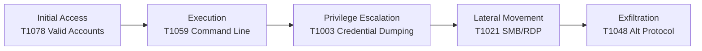

# 🛡️ SOC Analyst Technical Assessment Template

## 📘 Overview
This project demonstrates my ability to perform end-to-end SOC analysis — from SIEM alert triage and log correlation to MITRE ATT&CK mapping and incident response reporting.  


---

# 🛡️ SOC Analyst – SIEM Alert Analysis Template

A reusable template for documenting SIEM alerts in a structured and standardized format.

---

## 1. SIEM Alert Analysis

This section helps SOC Analysts classify, investigate, and respond to SIEM alerts with consistency.

---

## 1.1 Alert Summary

| Alert ID | Alert Title | Description | TP/FP | Category | Asset | Initial Action | Priority |
|----------|-------------|-------------|--------|----------|--------|----------------|----------|
|          |             |             |        |          |        |                |          |
|          |             |             |        |          |        |                |          |
|          |             |             |        |          |        |                |          |
|          |             |             |        |          |        |                |          |

---

## 1.2 Detailed Alert Investigation

**Alert ID:**  
**Source:** (SIEM / EDR / Firewall / CloudTrail / Email Gateway)  
**Description:**  

---

### 🔍 Key Indicators
- **Source IP:**  
- **Destination IP:**  
- **Username:**  
- **Host:**  
- **Event ID(s):**  
- **Timestamp(s):**  

---

### 🧠 Analysis  
Write 3–5 sentences explaining:  
- Why this is a True Positive or False Positive  
- What triggered the alert  
- What logs were reviewed  
- Your reasoning behind the classification  

---

### 🚨 Immediate Actions Taken
-  
-  
-  

---

### 🔥 Priority  
**Low / Medium / High / Critical**

---


## 2. Log Analysis & Threat Hunting

This section is used to document suspicious log activity, correlate events across multiple sources, and summarize attacker behavior.

---

### 2.1 Suspicious Events

| Timestamp (UTC) | Log Source | Event ID / Type | Description | User / IP / Host |
|------------------|------------|------------------|--------------|-------------------|
|                  |            |                  |              |                   |
|                  |            |                  |              |                   |
|                  |            |                  |              |                   |

---

### 2.2 Correlation Across Sources

Document combined evidence observed across multiple log sources.

**Examples:**
- **Firewall:** External RDP attempt from `X.X.X.X`  
- **Windows Logs:** Successful Logon Type 10  
- **EDR:** Credential dumping attempt detected  
- **DNS Logs:** Lookup of suspicious domain  
- **Email Logs:** Phishing email delivered to user mailbox  

➡️ *Explain in 1–2 paragraphs how the attacker moved through the environment, what techniques they used, and how log sources support each other.*

---

### 2.3 Summary of Findings

Provide a high-level narrative describing the attacker’s behavior.

**Example:**  
> The attacker used stolen credentials to authenticate via RDP, escalated privileges using Mimikatz, and attempted lateral movement through SMB to access network shares.

---


## 3. MITRE ATT&CK Mapping

This section maps observed adversary techniques to the MITRE ATT&CK framework.  
It helps identify attacker behaviors, correlate patterns, and understand the full attack chain.

---

### 3.1 MITRE ATT&CK Technique Table

| Tactic (ATT&CK)            | Technique ID | Technique Name                     | Evidence Observed                           | Log Source(s)                 |
|----------------------------|--------------|------------------------------------|----------------------------------------------|--------------------------------|
| **Initial Access**         | T1078        | Valid Accounts                     | Successful RDP login using stolen creds      | Firewall, Windows Security Logs |
| **Execution**              | T1059        | Command-Line Execution             | `cmd.exe`, `powershell.exe` launched         | Windows Event Logs            |
| **Persistence**            | T1547        | Boot or Logon Autostart Execution  | Registry Run key modification                | Windows Registry, Sysmon      |
| **Privilege Escalation**   | T1003        | Credential Dumping                 | `mimikatz.exe` invocation                    | EDR, Sysmon                   |
| **Defense Evasion**        | T1070        | Indicator Removal on Host          | Clearing event logs / deleted artifacts      | Windows Logs, Sysmon          |
| **Credential Access**      | T1555        | Credentials from Password Stores    | LSASS memory access attempt                  | EDR telemetry                 |
| **Discovery**              | T1087        | Account Discovery                  | `net user /domain`                           | Process Creation Logs         |
| **Lateral Movement**       | T1021        | SMB / RDP Remote Services         | Attempting access to `\\HOST\c$` shares      | Firewall, Windows Logs        |
| **Collection**             | T1119        | Automated Collection               | Accessing file shares repeatedly             | Network Logs                  |
| **Exfiltration**           | T1048        | Exfiltration Over Alternative Protocol | Unusual SMB traffic or outbound data transfer | Firewall, Network Monitoring  |
| **Command & Control**      | T1095        | Non-Application Layer Protocol     | Suspicious outbound connections              | Firewall, Proxy Logs          |

> **Note:**  
> You can add or remove techniques depending on the incident.  
> These techniques represent common enterprise attack patterns.

---

### 3.2 MITRE ATT&CK Narrative

Provide a short attack-chain narrative mapped to MITRE ATT&CK.

**Example Template:**

> The attacker gained **Initial Access (T1078 – Valid Accounts)** by using compromised credentials to authenticate via RDP.  
> After login, they performed **Execution (T1059 – Command-Line Execution)** using `cmd.exe` and PowerShell to run discovery commands.  
> They then used **Credential Access (T1003 – Credential Dumping)** with a tool resembling *Mimikatz* to extract additional credentials from LSASS.  
> With these elevated credentials, the attacker attempted **Lateral Movement (T1021 – SMB/RDP)** by browsing administrative shares on multiple hosts.  
> Finally, unusual outbound SMB and network activity suggests possible **Exfiltration (T1048 – Alternative Protocol)**.

---

### 3.3 ATT&CK Flow Diagram (Optional)

If you want a visual diagram, you can add this Mermaid chart:


## 4. Incident Response Actions

This section documents how the incident was contained, what Indicators of Compromise (IOCs) were discovered, and how the attack unfolded over time.  
Use it to maintain a clear, repeatable record of your response steps for each incident.

---

### 4.1 Initial Containment

Describe all **immediate actions** taken to stop or slow down the attack once detected.

**Checklist (tick or update as applicable):**

- [ ] Isolated compromised hosts from the network (e.g., removed from domain, blocked VLAN, disabled NIC)
- [ ] Disabled or locked compromised user accounts
- [ ] Blocked malicious IP addresses at firewall / WAF / security gateway
- [ ] Blocked malicious domains and URLs at DNS / proxy / secure web gateway
- [ ] Stopped or killed malicious processes on endpoints
- [ ] Quarantined or deleted known malicious files
- [ ] Disabled risky services or protocols (e.g., SMBv1, external RDP)
- [ ] Revoked API keys, tokens, or sessions involved in the incident
- [ ] Captured volatile data before shutdown (memory, network connections, running processes)
- [ ] Notified internal stakeholders (IT, management, compliance, etc.)
- [ ] Escalated to incident commander / CSIRT if required

**Containment Summary (free text):**

> _Example:_ Immediately after detecting suspicious RDP activity, the affected workstation was isolated from the network using EDR network containment. The `john.smith` account was disabled in Active Directory, and the source IP `198.51.100.73` was blocked at the perimeter firewall. Known malicious binaries identified by EDR were quarantined for further analysis.

---

### 4.2 Indicators of Compromise (IOCs)

Document all **known IOCs** that can be used for detection, hunting, and blocking.  
Group them by type (file, network, user/access, registry, etc.).

#### 4.2.1 File-Based IOCs

| File Name                  | Path / Location                     | Hash (MD5 / SHA256)                         | Behavior / Description                              |
|---------------------------|--------------------------------------|---------------------------------------------|----------------------------------------------------|
|                           |                                      |                                             |                                                    |
|                           |                                      |                                             |                                                    |

> _Guidance:_ Include any identified malware, droppers, scripts, or tools (e.g., `mimikatz.exe`, `invoice_payment.pdf.exe`, `ransomnote.txt`).  
> If possible, record cryptographic hashes for future detection and blocking.

---

#### 4.2.2 Network-Based IOCs

| Indicator Type | Value                    | Notes / Context                                      |
|----------------|--------------------------|------------------------------------------------------|
| IP             |                          | (e.g., C2 server, brute-force source, Tor exit node) |
| Domain         |                          | (e.g., phishing domain, C2 domain, malware delivery) |
| URL            |                          | (e.g., payload download link, phishing landing page) |
| Port / Proto   |                          | (e.g., unusual port usage, non-standard protocol)    |

> _Guidance:_ Include external IPs, domains, URLs, and any unusual ports or protocols associated with the attack.  
> Mark those confirmed as malicious vs those still under investigation if needed.

---

#### 4.2.3 User / Access IOCs

| Username / Account         | Observed Behavior                                      | Notes (Legit / Stolen / Shared / Service)             |
|----------------------------|--------------------------------------------------------|-------------------------------------------------------|
|                            |                                                        |                                                       |
|                            |                                                        |                                                       |

> _Guidance:_ List accounts that were abused, brute-forced, used for lateral movement, or escalated to admin roles.  
> Mention whether they are regular users, admins, service accounts, or third-party/vendor accounts.

---

#### 4.2.4 Other IOCs (Optional)

You can also track:

- **Registry keys** (e.g., persistence via `Run` keys)
- **Scheduled tasks / cron jobs**
- **Email-based indicators** (sender, subject, attachment name)
- **Cloud IOCs** (access keys, roles, suspicious API calls)

Add more tables if needed, for example:

```text
Registry Key: 
Value: 
Purpose: 
Behavior: 
```

### 4.3 Attack Timeline

The attack timeline provides a chronological breakdown of the adversary’s actions from the initial compromise to containment and remediation.  
A precise timeline helps analysts understand attacker dwell time, technique progression, pivoting behavior, and the impact of SOC response actions.

Use **actual log timestamps (UTC)** from SIEM, EDR, Windows Event Logs, firewall logs, email gateways, cloud logs, or proxy logs.

| Time (UTC)          | Event / Phase                     | Details                                                                                     |
|---------------------|------------------------------------|---------------------------------------------------------------------------------------------|
| YYYY-MM-DD HH:MM    | **Initial Access**                 | e.g., Phishing email delivered to user; malicious link clicked; exposed credentials stolen |
| YYYY-MM-DD HH:MM    | **Execution**                      | e.g., User executed `invoice_payment.pdf.exe` triggering initial malware payload            |
| YYYY-MM-DD HH:MM    | **Privilege Escalation**           | e.g., Attacker executed Mimikatz to obtain local admin or domain admin privileges           |
| YYYY-MM-DD HH:MM    | **Lateral Movement**               | e.g., SMB connections initiated to `\\10.10.15.5\c$` and other internal network shares      |
| YYYY-MM-DD HH:MM    | **Data Collection / Exfiltration** | e.g., Large outbound HTTPS transfer to unknown external IP (if applicable)                  |
| YYYY-MM-DD HH:MM    | **Detection**                      | e.g., SIEM alert triggered for unusual RDP activity / credential dumping behavior           |
| YYYY-MM-DD HH:MM    | **Containment**                    | e.g., Endpoint isolated, accounts disabled, firewall block applied                          |
| YYYY-MM-DD HH:MM    | **Recovery / Remediation Start**   | e.g., Systems reimaged, passwords reset, patches applied, logs reviewed                    |

#### Guidance:
- Always convert timestamps to **UTC** for consistency.
- Cross-reference timestamps across logs:
  - Windows Security logs → Logon Type 10 (RDP)
  - Sysmon logs → process creation (4688)
  - Firewall logs → inbound/outbound traffic
  - EDR telemetry → credential dumping, persistence
  - Email logs → phishing delivery timestamps
- A detailed timeline helps identify:
  - Dwell time  
  - Lateral movement paths  
  - Privilege escalation vectors  
  - SOC detection response time  
  - Whether the attacker performed reconnaissance or exfiltration  

---

## 5. Business Impact Assessment

This section evaluates the operational, financial, and reputational consequences of the security incident.  
A well-structured Business Impact Assessment (BIA) helps leadership understand risk severity, recovery urgency, and long-term implications.

---

### 5.1 Affected Systems

Document every system involved or impacted by the incident.

| System / Asset Type      | Hostname / ID | Function / Role | Severity of Impact | Notes |
|--------------------------|----------------|------------------|---------------------|-------|
|                          |                |                  | Low/Med/High/Crit   |       |
|                          |                |                  |                     |       |
|                          |                |                  |                     |       |

**Guidance:**  
List systems such as:
- Workstations  
- Servers (DB, application, file, domain controllers)  
- Cloud assets (IAM roles, EC2 instances, S3 buckets, storage accounts)  
- Network equipment (firewalls, VPN gateways)  
- SaaS systems (email, CRM, ERP)  

Include **why each asset matters** (e.g., financial processing, HR data, authentication infrastructure).

---

### 5.2 Operational Impact

Describe how the incident affected normal business operations.

**Example Template:**

- Were employees unable to work?  
- Did systems go offline?  
- Were business processes delayed?  
- Was customer service affected?  
- Were internal teams blocked from completing tasks?  
- Was there downtime, service degradation, or degraded performance?  

**Fillable Section:**

> _Example:_ The ransomware attack caused encryption of shared file systems, preventing the Finance and Operations departments from accessing key documents. This resulted in delays in payroll processing and halted invoice generation for 6 hours.

---

### 5.3 Data Loss Risk

Assess what data may have been exposed, modified, or stolen.

| Data Type | Sensitivity | Impact if Lost | Evidence of Exposure | Notes |
|-----------|-------------|----------------|-----------------------|--------|
|           | Public / Internal / Confidential / Restricted | Low/Med/High/Crit | Confirmed / Possible / None |        |
|           |             |                |                       |        |

**Considerations:**
- PII (Personal Identifiable Information)
- PHI (Protected Health Information)
- Financial records
- Intellectual property
- Customer data
- Employee data
- Credentials or tokens
- Configuration files or secrets

**Assessment Guidance:**
- Was data encrypted?  
- Was data exfiltrated?  
- Was sensitive data altered or corrupted?  
- Were backups available and intact?  
- Did integrity loss occur?

**Fillable narrative section:**

> _Example:_ There is high risk of credential compromise due to confirmed execution of Mimikatz on the Finance workstation. No confirmed evidence of large-scale data exfiltration, but SMB access logs indicate potential access to sensitive accounting files.

---

### 5.4 Financial / Reputational Impact

Break down the potential or confirmed financial costs and reputational damage.

#### **5.4.1 Financial Impact**

| Category | Description | Estimated Cost | Notes |
|----------|-------------|----------------|--------|
| Downtime | Business operations disrupted | $ | |
| Recovery Costs | Reimaging, rebuilding systems, overtime | $ | |
| Incident Response | Consultants, DFIR teams, tools | $ | |
| Regulatory Fines | GDPR, Privacy Act, industry compliance | $ | |
| Lost Revenue | Impact from outages or delays | $ | |
| Ransom Demanded (if any) | Requested by attacker | $ | |

**Additional factors:**
- Cost of implementing improved security controls  
- Productivity loss across departments  
- SLA penalties (if customer-facing services were affected)  

---

#### **5.4.2 Reputational Impact**

Explain how the incident affected public perception, customer trust, or internal confidence.

**Questions to answer:**
- Was this incident made public?  
- Did it affect customer trust or contractual obligations?  
- Did leadership need to notify stakeholders or clients?  
- Was media or regulatory disclosure required?  
- Did employees lose trust in internal security processes?  

**Fillable narrative:**

> _Example:_ If evidence confirms data exfiltration, the organization may be required to notify affected customers. This could reduce trust in the company’s ability to safeguard financial data, particularly among institutional clients.

---

### 5.5 Overall Risk Rating (Optional)

Use a simple risk scoring to summarize impact + likelihood.

| Impact Level | Likelihood | Overall Risk |
|--------------|------------|---------------|
| Low/Medium/High/Critical | Unlikely / Possible / Likely / Almost Certain | Low → Critical |

**Fillable Example:**

> _Assessment:_  
> Impact: **High**  
> Likelihood of recurrence: **Likely**  
> Overall Risk: **High**

---

### 5.6 Summary Statement

Provide an executive-level statement summarizing the business impact.

> _Example Summary:_  
> The incident caused critical disruption to Finance and Operations due to server encryption and credential compromise. Although data exfiltration is unconfirmed, the presence of credential dumping tools indicates significant risk. Estimated downtime resulted in approximately $14,000 in lost productivity and recovery costs are expected to exceed $25,000. The potential reputational impact remains moderate pending final forensic review.

---

## 6. Recommendations

This section provides both short-term remediation steps and long-term security improvements based on the findings of the incident.  
It is designed to guide SOC teams, IT administrators, and leadership on actions that reduce risk, prevent recurrence, and strengthen the organization’s security posture.

---

### 6.1 Short-Term Remediation Actions

Short-term actions aim to **contain the immediate threat**, eliminate malicious artifacts, and restore business operations as quickly and safely as possible.

#### **Immediate Technical Remediation**
- **Reset or disable compromised accounts**
  - Force password resets for affected users  
  - Revoke all active authentication tokens, API keys, or cloud sessions  
  - Reset service accounts with elevated privileges  

- **Patch and update affected systems**
  - Apply OS and application patches  
  - Close exploited vulnerabilities (e.g., RDP, SMB, VPN, outdated software)  

- **Isolate and reimage compromised hosts**
  - Remove infected systems from the network  
  - Reimage or restore from known-good backups  
  - Validate integrity before reconnecting to production environments  

- **Block malicious network indicators**
  - Block malicious IPs, domains, and URLs at:
    - Firewall  
    - Proxy  
    - DNS security  
    - Email gateway  
  - Review outbound connections for ongoing C2 activity  

- **Quarantine malware and artifacts**
  - Remove or isolate malicious binaries, scripts, and persistence mechanisms  
  - Add malware hashes (MD5/SHA256) to EDR/SIEM blocklists  

---

#### **Visibility & Monitoring Improvements**
- **Increase SIEM alerting sensitivity**
  - Enable detections for credential dumping, privilege escalation, and lateral movement  
  - Tune correlation rules for suspicious RDP/PowerShell activity  

- **Enable enhanced logging**
  - PowerShell logging (Module, ScriptBlock, Transcription)  
  - Windows Security logs (Privilege Use, Logon/Logoff, Object Access)  
  - Sysmon for high-fidelity endpoint telemetry  
  - Cloud logs (AWS CloudTrail, Azure Activity Logs)  

- **Perform deep endpoint scans**
  - Full EDR/XDR scans  
  - Memory analysis (if applicable)  
  - Validate no secondary payloads remain  

---

#### **Short-Term Risk Mitigation**
- Disable unnecessary protocols (e.g., **SMBv1**, external **RDP**)  
- Increase brute-force protection (lockout thresholds, MFA enforcement)  
- Enable or tighten **Geo-Blocking** for VPN and RDP access  
- Temporarily restrict privileged access across the environment  

---

### 6.2 Long-Term Security Improvements

Long-term recommendations focus on **strategic improvements**, **security hardening**, and organization-wide changes to prevent similar incidents in the future.

---

#### **Identity & Access Management (IAM)**
- **Enforce Multi-Factor Authentication (MFA)** for all users, especially:
  - Admin accounts  
  - Remote access accounts  
  - Cloud accounts  

- **Implement Least Privilege & Zero Trust**
  - Remove unused admin rights  
  - Review and tighten group memberships (Domain Admins, Global Admins)  
  - Use Just-In-Time access (PIM/PAM solutions)  

- **Harden Password & Access Policies**
  - Increase password complexity  
  - Rotate high-privilege credentials regularly  
  - Add password spray / brute force detection rules  

---

#### **Endpoint Security Improvements**
- **Deploy or enhance EDR/XDR with tamper protection**
  - Prevent unauthorized shutdown of EDR agents  
  - Ensure devices report real-time telemetry  

- **Harden endpoint baselines**
  - Use CIS benchmarks  
  - Disable legacy authentication  
  - Apply host firewall restrictions  

- **Implement application allowlisting**
  - Prevent execution of unauthorized tools like Mimikatz, PsExec, or unknown binaries  

---

#### **Network Security Enhancements**
- **Apply network segmentation**
  - Separate high-value systems (DCs, databases, file servers)  
  - Restrict SMB lateral movement  
  - Limit east-west traffic  

- **Enhance firewall/proxy rules**
  - Block outbound traffic to suspicious regions  
  - Inspect SSL/TLS traffic where legally allowed  
  - Block Tor / VPN anonymizer endpoints  

- **Deploy Intrusion Detection/Prevention (IDS/IPS)**
  - Enable anomaly detection  
  - Add rules for credential dumping, lateral movement, C2 behavior  

---

#### **Email & Phishing Protection**
- Strengthen email filtering (DMARC, DKIM, SPF)
- Enable advanced attachment scanning and sandboxing  
- Block macros and executable attachments by default  
- Use AI-based phishing detection platforms  

---

#### **Backup & Disaster Recovery**
- Validate the integrity of backup systems regularly  
- Use immutable backups to protect against ransomware  
- Reduce RPO/RTO impact through more frequent backup cycles  
- Test restore procedures quarterly  

---

#### **Detection Engineering & SIEM Tuning**
- Develop new correlation rules based on this incident  
- Add detections for:
  - Suspicious PowerShell  
  - Privilege escalation behavior  
  - SMB share enumeration  
  - LSASS access attempts  
  - Anomalous RDP logons  

- Create dashboards for:
  - Authentication anomalies  
  - Privilege escalations  
  - Lateral movement attempts  
  - Endpoint execution anomalies  

---

#### **Governance, Training & Culture**
- Conduct **phishing awareness training** quarterly  
- Run **tabletop exercises** simulating similar attacks  
- Update IR playbooks and SOPs based on lessons learned  
- Create a security champions network within departments  
- Review compliance requirements (ISO 27001, NIST CSF, Essential 8, SOC2)  

---

### 6.3 Summary of Recommendations

> **Short-Term:**  
> Contain the threat, isolate compromised systems, patch vulnerabilities, block IOCs, and restore services safely.

> **Long-Term:**  
> Strengthen IAM, deploy EDR with tamper protection, implement Zero Trust, improve SIEM visibility, harden endpoints, and enhance phishing defense.

---

Use this section as a **repeatable recommendation framework** for every incident or lab simulation.

## 7. Executive Summary

The Executive Summary provides a high-level, non-technical overview of the incident for stakeholders, executives, and decision-makers.  
This section explains **what happened**, **how it happened**, **what was impacted**, and **what actions were taken**, without requiring deep cybersecurity knowledge.  
It should be clear, concise, and business-focused.

---

### 7.1 Purpose of This Summary

This summary is intended for:
- Senior leadership  
- Non-technical stakeholders  
- Legal, compliance, and risk teams  
- External auditors (if required)  
- Incident response managers  

It communicates the **scope**, **impact**, and **resolution** of the incident in a format that is brief but informative.

---

### 7.2 Incident Overview (What Happened)

Provide a clear outline of the event:

- **Date & time of detection:**  
- **Date & time of initial compromise (if known):**  
- **Summary of the attack type:** (e.g., phishing, credential theft, malware, ransomware, insider activity, misconfiguration, cloud breach)  
- **Entry point / initial access method:**  
- **Affected system(s):**  
- **Threat actor intent (if identifiable):**  
- **Classification:**  
  - Security Incident  
  - Data Breach  
  - Privacy Incident  
  - Operational Disruption  

**Fillable narrative example:**

> On **[date/time]**, the Security Operations Center detected suspicious activity on a Finance department workstation involving repeated authentication attempts. Further investigation confirmed unauthorized RDP access using compromised user credentials. The threat actor escalated privileges, executed credential dumping tools, and attempted lateral movement within the internal network. The incident was contained before any confirmed data exfiltration occurred.

---

### 7.3 Root Cause Summary (Why It Happened)

Describe how the attacker succeeded:

- **Compromised credentials**  
- **User phishing interaction**  
- **Unpatched vulnerability**  
- **Weak or absent MFA**  
- **Misconfigured system**  
- **Insufficient network segmentation**  
- **Supply chain compromise**  

**Fillable narrative example:**

> The root cause of the incident was the use of compromised credentials obtained through a phishing email that targeted Finance users. Lack of MFA on remote access allowed the attacker to authenticate successfully via external RDP.

---

### 7.4 Impact Summary (What Was Affected)

Summarize the **business impact** without deep technical details.

**Potential impacts to consider:**
- Operational downtime  
- Disrupted business processes  
- Unauthorized access to systems  
- Data exposure or manipulation  
- Reputational impact  
- Financial losses  

**Fillable narrative example:**

> The incident affected one Finance workstation and potentially exposed internal accounting files accessed during lateral movement attempts. There was minimal operational impact, and no evidence was found indicating large-scale data exfiltration. The business experienced approximately **X hours** of downtime for remediation and validation.

---

### 7.5 Containment & Response Summary (What Was Done)

Summarize the major actions taken to stop the attack.

**Key points to include:**
- Isolation of affected systems  
- Account disablement or reset  
- Blocking malicious IPs/domains  
- Quarantining malware  
- Patching vulnerabilities  
- Reviewing logs across systems  
- Restoring services  

**Fillable narrative example:**

> The compromised workstation was immediately isolated using EDR network containment. The affected user account was disabled, and all privileged accounts in the Finance OU were rotated as a precaution. Firewall rules were updated to block the source IP. The SOC team validated that no persistence mechanisms remained and restored the workstation from a clean system image.

---

### 7.6 Recovery & Restoration Summary

Document how the organization returned to normal operation.

- Restoration from backups  
- Reimage of systems  
- Password resets  
- Re-enabling of services  
- Validation of systems for integrity  
- Enhanced monitoring period  

**Fillable narrative example:**

> After containment, the impacted workstation was reimaged and restored from known-good backups. Enhanced monitoring was applied for 72 hours across key Finance assets, with no further suspicious activity detected. All affected services were restored and verified operational.

---

### 7.7 Long-Term Improvements (High-Level)

Provide management with clear, strategic improvement goals.

- Implement MFA for all remote access  
- Deploy or enhance EDR/XDR capabilities  
- Improve SIEM alert rules  
- Strengthen email security and phishing defenses  
- Conduct user awareness training  
- Improve endpoint hardening baselines  
- Review IAM and privilege access practices  
- Enhance incident response playbooks  

**Fillable narrative example:**

> To prevent recurrence, MFA will be enforced for all remote access paths, SIEM detection rules for anomalous authentication will be expanded, and quarterly phishing awareness training will be introduced. The organization will also improve endpoint security controls and review privilege assignments for Finance personnel.

---

### 7.8 Final Executive Statement

This should be a short, polished, business-friendly summary.

**Template:**

> The incident was successfully contained with minimal business disruption. No confirmed data loss occurred, though credential exposure risk remains under review. Immediate actions were taken to secure affected systems, and long-term improvements are underway to reduce the likelihood of similar events in the future.

---

**This concludes the Executive Summary for the incident.**

---

## 8. Evidence & Attachments

This section is used to store and reference all supporting artifacts collected during the investigation.  
Evidence may include logs, screenshots, malware samples, SIEM queries, network packet captures, forensic exports, or any other relevant materials.

The purpose of this section is to ensure that all findings are **verifiable**, **traceable**, and **well-documented** for both technical and non-technical audiences.

---

### 8.1 Log Evidence

Attach or reference any logs used during analysis.

**Common log sources to include:**
- **Windows Event Logs**
  - Logon events (4624/4625)
  - Privilege escalation (4672, 4673, 4674)
  - Process creation (4688)
  - PowerShell logs (4103, 4104, 4105)

- **EDR / XDR Telemetry**
  - Alerts (malware, suspicious behavior)
  - Process tree screenshots
  - Block/quarantine logs

- **Firewall / Network Logs**
  - Source + destination traffic patterns
  - Allowed or blocked connections
  - Unusual outbound traffic signatures

- **Cloud Logs**
  - AWS CloudTrail events
  - Azure AD Sign-In logs
  - IAM role assumption logs

**Example Table:**

| Evidence Type        | File / Reference | Description | Hash (Optional) |
|----------------------|------------------|-------------|------------------|
| Windows Event Logs   | `/evidence/win_logs_e1.json` | Logon failures + RDP success | SHA256: |
| EDR Alert Export     | `/evidence/edr_alert_03.csv` | Credential dumping detection | |
| Firewall Log Extract | `/evidence/fw_conn_logs.txt` | External IP accessing host | |

> **Note:** Store logs in your repo only if sanitized and safe.  
> Never upload sensitive corporate logs to public GitHub.

---

### 8.2 Screenshots

Screenshots help visualize evidence during the investigation.

**Common screenshot types:**
- SIEM dashboards  
- EDR process trees  
- Alert details  
- Suspicious PowerShell execution  
- RDP login timestamps  
- File system changes  
- Registry modifications for persistence  

**Screenshot Reference Example:**

| Screenshot | Description |
|-----------|-------------|
| `rdp_attempts.png` | External unauthorized RDP login attempts |
| `mimikatz_process_tree.png` | EDR capture of credential dumping |
| `suspicious_powershell.png` | Encoded PowerShell command execution |

---

### 8.3 SIEM Queries Used

Document all SIEM queries used for threat hunting, such as:  
- Splunk SPL  
- Elastic Query DSL  
- Sentinel KQL  
- Wazuh/OSSEC rules  
- CrowdStrike Falcon queries  

**Example (KQL – Microsoft Sentinel):**
```kusto
SecurityEvent
| where EventID == 4624
| where LogonType == 10
| where Account contains "john.smith"
| project TimeGenerated, IPAddress, Computer, Account
```

### 8.4 Network Forensics

This subsection focuses on **network-layer evidence** collected during the incident.  
Network forensics helps validate lateral movement, data exfiltration, C2 communication, and suspicious remote access.

#### 8.4.1 Typical Network Evidence

Common artifacts you may collect:

- **Packet captures (PCAP/PCAPNG)**
  - Full packet captures for deep protocol inspection (e.g., via Wireshark, tcpdump)
  - Targeted captures for specific hosts, ports, or time windows

- **Zeek logs** (if Zeek is deployed)
  - `conn.log` – connection metadata (source/dest IP, ports, protocol, duration)
  - `http.log` – HTTP requests, user agents, URIs
  - `dns.log` – DNS queries, domain resolution
  - `smb_files.log` / `smb_mapping.log` – SMB file access, shares, and paths

- **Suricata / Snort IDS alerts**
  - Signatures for exploit attempts, C2 communication, malware traffic

- **Firewall & Proxy logs**
  - Incoming remote access attempts (RDP/VPN/SSH)
  - Outbound connections to unknown or high-risk IPs/domains
  - Unusual ports and protocols

#### 8.4.2 Example Evidence Table

Use this table format to document your collected network evidence:

| File / Reference                        | Description                                      | Notes                                         |
|-----------------------------------------|--------------------------------------------------|-----------------------------------------------|
| `/evidence/network/rdp_traffic.pcap`    | Network capture during unauthorized RDP logins  | Filter on TCP 3389, inspect RDP session setup |
| `/evidence/network/smb_access.log`      | SMB enumeration & file access events            | Useful for detecting lateral movement via SMB |
| `/evidence/network/zeek_conn.log`       | Zeek connection metadata for timeframe of attack| Look for unusual external IPs and long-lived sessions |
| `/evidence/network/suricata_alerts.json`| IDS alerts triggered during the incident        | Pivot on high-severity alerts and source IPs  |

> **Guidance:**  
> - Always correlate timestamps with host logs (Windows, EDR) and SIEM alerts.  
> - Use PCAP only when necessary; prefer metadata logs to reduce storage and privacy risks.  

---

### 8.5 Malware / Suspicious File Evidence

This subsection documents **malicious or suspicious files** discovered during the investigation. These can include droppers, payloads, tools, or scripts.

#### ⚠️ Safety Warning (For Public Repos)

If using GitHub (especially public):

- Do **NOT** upload live malware directly.
- If absolutely required for educational labs:
  - Sanitize or obfuscate samples where possible.
  - Compress archives using a password (commonly `infected`).
  - Clearly label the content as **malware** or **test payload**.
- Alternatively, **only reference hashes and filenames**, without distributing the files.

#### 8.5.1 File Evidence Template

Use this table to track malware or suspicious files:

| File Name                | Description                          | Location                  | Hash (SHA256)                       |
|--------------------------|--------------------------------------|---------------------------|-------------------------------------|
| `mimikatz.exe`           | Credential dumping tool              | `/evidence/malware/`      |                                     |
| `invoice_payment.pdf.exe`| Malicious phishing attachment payload| `/evidence/malware/`      |                                     |
| `dropper.bin`            | Secondary dropper / loader           | `/evidence/malware/`      |                                     |

> **Guidance:**  
> - Compute **SHA256 hashes** using tools like `sha256sum`, `Get-FileHash`, or EDR output.  
> - If working in a lab, note whether malware behavior was observed in a sandbox (e.g., Any.Run, FlareVM, etc.).  
> - For each file, consider also documenting:
>   - How it was delivered (phishing, drive-by download, RDP)  
>   - Whether AV/EDR detected it  
>   - Whether it established persistence  

---

### 8.6 Registry, Scheduled Tasks & Persistence Artifacts

This subsection focuses on **persistence mechanisms** used by the attacker or malware to survive reboots or maintain long-term access.

#### 8.6.1 Common Persistence Techniques

Examples to look for:

- **Registry-based autostart entries**
  - `Run` and `RunOnce` keys
  - Shell or UserInit Hijacking
- **Scheduled tasks / cron jobs**
  - Tasks executing scripts or binaries periodically
- **WMI persistence**
  - Event consumers and filters
- **Startup folder artifacts**
  - Executables, scripts, or shortcuts in startup directories

#### 8.6.2 Example Persistence Evidence Table

| Evidence Type  | Path / Details                                                      | Description                               |
|----------------|---------------------------------------------------------------------|-------------------------------------------|
| Registry Key   | `HKCU\Software\Microsoft\Windows\CurrentVersion\Run\backdoor`       | Persistence executable launched at logon  |
| Scheduled Task | `Task Name: updater.exe` – triggers `C:\Tools\updater.exe` hourly   | Executes malicious binary every hour      |
| Startup Folder | `C:\Users\Public\start.exe`                                         | Dropper placed in public startup location |

> **Guidance:**  
> - Capture **before/after** state where possible (e.g., reg export).  
> - Use Sysmon, Autoruns, or forensic tools to detect new persistence points.  
> - Always correlate persistence artifacts with process execution logs and timestamps.  

---

### 8.7 Email Evidence (If Applicable)

If the incident involved **phishing, business email compromise, or malware via email**, this subsection records all email-based evidence.

#### 8.7.1 Types of Email Evidence

- Raw email files (`.eml`, `.msg`) – sanitized for lab use
- Email headers (full headers for routing, SPF, DKIM, DMARC analysis)
- Suspicious attachments and links
- Sender address and spoofed domains
- Delivery time and user interaction timeline

#### 8.7.2 Example Email Evidence Table

| File / Reference                          | Description                           |
|-------------------------------------------|---------------------------------------|
| `/evidence/email/phishing_email.eml`      | Original phishing email               |
| `/evidence/email/header.txt`              | Full email header for analysis        |
| `/evidence/email/attachment_name.txt`     | Metadata or extracted text of payload |

> **Guidance:**  
> - Analyze headers to see **SPF/DKIM/DMARC** status and mail relay path.  
> - Identify if domain is newly registered or suspicious.  
> - Map which users received and interacted with the email.  

---

### 8.8 Cloud Evidence (Optional)

If cloud resources were involved (AWS, Azure, GCP, SaaS), this subsection documents **cloud-specific evidence**.

#### 8.8.1 Common Cloud Evidence Types

- **IAM Logs** – role assumptions, policy changes, key usage  
- **Audit Logs**
  - AWS CloudTrail
  - Azure Activity Logs / Sign-In Logs
  - GCP Cloud Audit Logs
- **MFA Configuration Changes**
- **Suspicious API Calls**
  - Unusual geographic patterns
  - Abnormal services or actions
- **Cloud Storage Activity**
  - S3 bucket access logs
  - Blob storage reads/writes

#### 8.8.2 Example Cloud Evidence Table

| Cloud Provider | Evidence File                               | Description                                     |
|----------------|----------------------------------------------|-------------------------------------------------|
| AWS            | `/evidence/aws/cloudtrail_logs.json`         | Unauthorized `AssumeRole` attempts              |
| Azure          | `/evidence/azure/signin_logs.csv`            | Impossible travel login patterns for admin user |

> **Guidance:**  
> - Always correlate cloud logs with identity activity (e.g., Okta, Entra ID, local AD).  
> - Look for role escalations, API calls from unusual IP ranges, or access from unexpected countries.  

---

### 8.9 Chain of Custody (Optional but Professional)

This subsection is essential for **formal incident response, legal cases, or forensic-grade investigations**.  
It documents **who collected what**, **when**, and **how it was stored**, ensuring **integrity and admissibility** of evidence.

#### 8.9.1 Chain of Custody Table

| Evidence Item                    | Collected By     | Date & Time (UTC)   | Storage Location                               | Integrity Verified (Y/N) |
|----------------------------------|------------------|----------------------|-----------------------------------------------|---------------------------|
| `/evidence/network/rdp_traffic.pcap` | L. Analyst       | 2025-03-07 09:14 UTC | Secured share: `\\ir-server\evidence\network` | Y                         |
| `/evidence/malware/invoice_payment.pdf.exe` | M. Forensics | 2025-03-07 09:32 UTC | Offline disk: `IR-Drive-01`                   | Y                         |

> **Guidance:**  
> - Use hashing (e.g., SHA256) to verify evidence integrity over time.  
> - Note every transfer of evidence between analysts, systems, or storage locations.  
> - For a portfolio, you can simulate chain-of-custody for realism (no real PII).  

---

### 8.10 Evidence Summary

This subsection provides a **brief, high-level summary** of all collected evidence and how it supports your conclusions.

#### 8.10.1 Example Summary

> A comprehensive set of logs, network captures, malware samples, email artifacts, and cloud audit logs were collected to validate attacker activity.  
> Evidence confirms:
> - Unauthorized RDP access from an external IP  
> - Execution of credential dumping tools on a Finance workstation  
> - Attempts at lateral movement using SMB shares  
> - Delivery of a malicious email attachment resembling a payment invoice  
>
> All evidence artifacts have been archived under the `/evidence/` directory structure and referenced throughout this report. These materials collectively support the incident timeline, MITRE ATT&CK mapping, and response actions documented in earlier sections.
---

## 👤 Author
**Luekrit Kongkamon**  
Aspiring Cloud & Cybersecurity Analyst | SOC | IAM | Cloud Security  
[LinkedIn](https://linkedin.com/in/luekritkongkamon) | [GitHub](https://github.com/luekrit)

 *This template is used for learning and documentation purposes to simulate SOC workflows and professional reporting style.*
